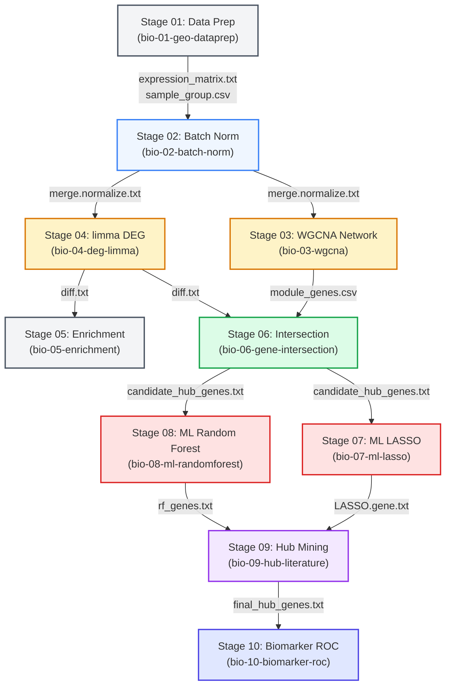

# End-to-End Bioinformatics Pipeline DAG & Data Contract Architecture

## 1. Global Directed Acyclic Graph (DAG) Topology

The bio-pipeline coordinates 10 distinct analytical skills spanning from raw microarray normalization to machine-learning biomarker discovery and literature validation:



---

## 2. Parallelization Opportunities

The DAG contains two distinct bifurcations where sub-processes can execute concurrently to maximize computational throughput:

### 2.1 Branch 1: Unsupervised Network vs. Supervised Linear Contrast
- **Stage 03 (WGCNA)** and **Stage 04 (limma DEG)**:
  - Both require only `merge.normalize.txt` and `sample_group.csv`.
  - WGCNA is compute- and memory-intensive (blockwise adjacency and topological overlap matrix calculation).
  - limma is fast (closed-form linear algebra).
  - Executing S03 and S04 in parallel saves up to $70\%$ total wall-clock runtime during data processing.

### 2.2 Branch 2: Dual-Algorithm Machine Learning Feature Selection
- **Stage 07 (LASSO Regression)** and **Stage 08 (Random Forest Permutation)**:
  - Both ingest `merged_file.txt` (candidate hub genes mapped to normalized expression values).
  - Stage 07 executes fast $L_1$ coordinate descent across 100 $\lambda$ values.
  - Stage 08 executes $K = 299$ permutation iterations across 500 decision trees.
  - Running S07 and S08 concurrently decouples CPU-bound permutation testing from convex optimization.

---

## 3. Strict Stage-to-Stage Data Contracts

| Stage | Input Files & Contracts | Primary Outputs | QC Stage-Gate Acceptance Criteria |
|---|---|---|---|
| **S01: Data Prep** | Raw GEO CEL files or series matrix | `expression_matrix.txt`, `sample_group.csv` | Missingness $< 20\%$, sample names match group keys. |
| **S02: Batch Norm** | `expression_matrix.txt`, `sample_group.csv` | `merge.normalize.txt`, `pca_post_batch.pdf` | Boxplots aligned, PCA clusters by biological phenotype rather than batch ID. |
| **S03: WGCNA** | `merge.normalize.txt` | `module_genes.csv`, `module_trait_cor.pdf` | Scale-free topology fit $R^2 > 0.85$, trait correlation $P < 0.05$. |
| **S04: limma DEG** | `merge.normalize.txt`, `sample_group.csv` | `diff.txt`, `volcano.pdf` | Both nominal $P$ and `adj.P.Val` reported; $|\log_2 \text{FC}| > 1$, $FDR < 0.05$. |
| **S05: Enrichment** | `diff.txt` | `go_enrichment.csv`, `kegg_enrichment.csv` | Benjamini-Hochberg adjusted $q < 0.05$. |
| **S06: Intersection** | `module_genes.csv`, `diff.txt` | `candidate_hub_genes.txt`, `venn_plot.pdf` | $|S_{\text{WGCNA}} \cap S_{\text{DEG}}| \ge 2$; valid gene symbols. |
| **S07: ML LASSO** | `candidate_hub_genes.txt`, `merge.normalize.txt` | `merged_file.txt`, `LASSO.gene.txt`, `cvfit.pdf` | $\ge 1$ non-zero feature at `lambda.min`. |
| **S08: ML Random Forest** | `merged_file.txt` | `richness.txt`, `rf_genes.txt`, `rf_importance.pdf` | $\ge 1$ gene with permutation $P < 0.05$. |
| **S09: Hub Literature** | `LASSO.gene.txt`, `rf_genes.txt` | `final_hub_genes.txt`, `literature_evidence_report.md` | $|S_{\text{LASSO}} \cap S_{\text{RF}}| \ge 1$; $\ge 3$ supporting citations via Scite MCP. |
| **S10: Biomarker ROC** | `final_hub_genes.txt`, `merged_file.txt` | `auc_report.csv`, `roc_single_gene.pdf`, `roc_combined.pdf` | Single gene $\text{AUC} \ge 0.70$ OR combined panel $\text{AUC} \ge 0.80$. |

---

## 4. Troubleshooting & Recovery Protocols

### 4.1 Gate Failures & Remedies

```
[Gate Failure: Intersection < 2 genes]
  ├── Issue: WGCNA module trait cut-off or DEG fold-change threshold is too strict.
  └── Recovery:
       1. Relax DEG threshold from |log2FC| > 1.5 to |log2FC| > 1.0 or FDR < 0.10.
       2. Evaluate next highest correlated WGCNA module (e.g., MEblue in addition to MEturquoise).
       3. Re-run: Rscript run_pipeline.R --start-stage=6 --end-stage=6

[Gate Failure: LASSO selects 0 features]
  ├── Issue: High regularization penalty (lambda.min path overly compressed).
  └── Recovery:
       1. Check cvfit.pdf; verify if deviance curve has a distinct minimum.
       2. Fallback to smallest lambda evaluated or top 5 non-zero features before truncation.
       3. Re-run: Rscript run_pipeline.R --start-stage=7 --end-stage=7 --force

[Gate Failure: Dual-Algorithm Hub Intersection is Empty]
  ├── Issue: LASSO selected collinear representatives while RF prioritized different pathway effectors.
  └── Recovery:
       1. The script automatically logs a warning and takes the union or top-ranked overlap.
       2. Increase RF permutations (nrep = 500) to stabilize ranking.
       3. Re-run: Rscript run_pipeline.R --start-stage=8 --end-stage=9
```

### 4.2 Breakpoint Resume (Checkpointing)
To resume an interrupted pipeline execution after resolving an issue:
```bash
# Resume from Stage 07 to conclusion
Rscript .agents/skills/bio-pipeline-orchestrator/scripts/run_pipeline.R --start-stage=7 --end-stage=10

# Perform dry-run validation without executing scripts
Rscript .agents/skills/bio-pipeline-orchestrator/scripts/run_pipeline.R --dry-run
```
